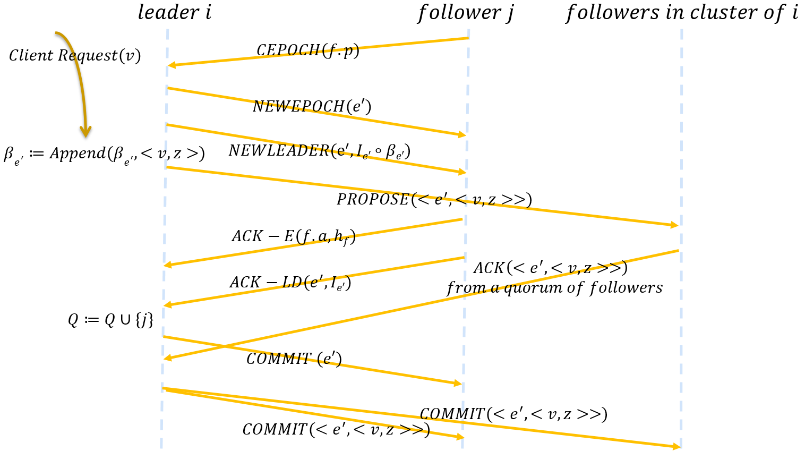

# Zab的TLA+规约 文档

## 概述
-	本实验是由论文*Junqueira F P, Reed B C, Serafini M. Zab: High-performance broadcast for primary-backup systems[C]//2011 IEEE/IFIP 41st International Conference on Dependable Systems & Networks (DSN). IEEE, 2011: 245-256.*启发。本实验根据该论文描述的Zab协议进行了Zab的TLA+规约。
-	我们对Zab使用TLA+工具做了形式化规约，并在此基础上做了一定量的模型检验来验证Zab的正确性。
-	由于论文中对Zab算法描述的精简和细节上的省略，在进行规约时协议中的一些细节由本实验作者进行修改和增加。如有疑问，欢迎指出。

## 支撑平台
TLA+ toolbox 版本1.7.0

## 运行
创建规约并以正常方式建模并运行模型

## 注意点

### Note 1
除了Election动作外，其余所有动作都是作用于某一具体服务器上的，这体现了"distributed"这一特性。因为论文不注重选主过程，所以在规约中我们抽象了选主过程，将其在Election动作中体现。Election动作是规约中唯一一个被抽象的动作。

### Note 2
Zab使用的是TCP信道，所以消息传递不会出现丢包、冗余、乱序的情况，我们用Sequence模块来模拟满足按序接收消息的性质。我们认为某个服务器不执行接收消息的动作可以模拟消息延迟，某个服务器不执行任何动作可以模拟单机失败。

### Note 3
我们关心的是系统内状态的一致，不关心client向系统请求和系统向client回复的细节和各个服务器向副本/状态机deliver的细节。因此我们粗化了ClientRequest，省略了向client的回复。我们假设每一个committed的transaction会被立即deliver到副本中，故可用变量history[i][1..commitIndex]来模拟节点i向副本deliver的transaction序列。

## 差异

### Issue 1 Line: 196, Action: Election
在论文Step l.1.1，Stepl.2.2中，当prospective leader接收到一个quorum的followers的消息才会作出下一个动作，这显然降低了系统可用性，我们应该把leader自身也算入到quorum中。考虑这样一种情况，系统内有3台服务器，其中有一台宕机，那么剩余两台服务器组成的集群中，leader接收到的某一消息最多只会来自于另一台，从而导致无法做出下一个动作，整个系统无法推进，这显然是违背了共识协议的高可用性的。于是，我们在动作Election中对变量cepochRecv和ackldRecv重置时就将leader节点ID加入到集合中。  
此外，我们可以得知prospective leader确定它的集群Q是根据论文Step l.1.1中的CEPOCH的接收信息。那么在Phase1初始阶段，Q是一个不满足quorum性质的set，这可能会触发动作LeaderTimeout来进行一轮新的election。故我们在动作Election中先确定了Q，使其在这轮中始终保持quorum性质。

### Issue 2 Line: 417, Action: LeaderHandleACKE; Line: 442, Action: LeaderDiscovery2Sync1
在论文Step l.1.2中，prospective leader接收到Q中每一个follower的ACK后在此选出最佳的数据进行更新。我们认为这个条件比较苛刻，在规约中当prospective leader接收到一个quorum的follower后就会选出最佳的数据进行更新。无论是选择论文中的做法，还是本实验中的做法，对算法的正确性不构成威胁。

### Issue 3 Line: 465, Action: FollowerSync1
在论文Step f.2.1中，由于在一般情况下，Q中的每个follower会在接收到NEWLEADER之前先接收到NEWEPOCH，故节点i的currentEpoch[i]与NEWLEADER中的epoch是相等的。在某些极端情况下，会有节点i的currentEpoch[i]比NEWLEADER中的epoch大。我们选择丢弃这样的比自己的epoch小的消息，论文中选择的是进行新一轮的election。

## 增加

### Issue 4 Line: 261, Action: Restart, RecoveryAfterRestart, HandleRecoveryRequest, HandleRecoveryResponse, FindCluster
论文Step l.3.3和Stepl.3.4描述了leader接收到CEPOCH进行回复，并在接收到ACK-LD后将其加入集群Q的过程，但是缺少了某个节点是如何找到leader并给leader发送CEPOCH的。这里我们给出了自己的想法，我们模仿View-Stamped Replication的恢复机制。具体过程为:  
1.	某一个节点重启(Restart)后，它会向其他节点发送RECOVERYREQUEST类型的消息(RecoveryAfterRestart)	  
2.	其他节点接收到该消息时将本地的leaderOracle和epoch返回(HandleRecoveryRequest)  
3.	当该节点收到多数派的回复时，选取回复中epoch最大且oracle非空的数据进行更新，我们认为此时它找到了leader，并向其发送CEPOCH请求同步(HandleRecoveryResponse,FindCluster)。  

当然，它找到的集群不一定的最新的集群，在这种情况下它会因为没得到CEPOCH的回复而重新进行寻找。

### Issue 5 Line: 340, Action: LeaderHandleCEPOCH
论文Step l.3.3和Stepl.3.4仅描述了leader接收到CEPOCH和ACK-LD时的处理，而没有描述prospective leader接收到来自不属于Q的节点的CEPOCH和ACK-LD的处理，我们考虑了这种情况下的处理方式。当prospective leader接收到来自节点i的CEPOCH，若i不属于Q，则先将i加入Q(leader是接收到ACK-LD时将i加入到Q)。随后prospective leader会判断自己是否已经广播过NEWEPOCH和NEWLEADER，来确保新加入Q的成员不会错失消息。这里我们不需要判断prospective leader是否广播过COMMIT-LD，因为广播了COMMIT-LD后状态会转为leader。

### Issue 6 Line: 636, Action: FollowerBroadcast2
我们考虑，当一个节点从选主阶段开始就在集群中，它顺序接收来自leader的消息，那么它每次收到的COMMIT中被committed的transaction一定存在于本地的history中。但是对于后加入集群的节点，这样的性质不一定一直被满足。  
我们考虑这样的情况，某一节点j找到leader i后，向i发送CEPOCH以加入集群，i与j正常交互，在收到ACK-LD后将j加入集群中。但在i发送NEWLEADER后，i收到某个client请求修改了history并广播一个PROPOSE类型的消息，这对j来说是屏蔽的，因为j还没有加入集群。但是在j加入集群后，j收到了该请求的COMMIT，但该committed的transaction不能在它的history中被找到。流程如下图所示。
  
因此，我们所做出的假设是，当某一follower收到的COMMIT中的transaction是本地没有的时，对leader重发CEPOCH来寻求状态一致。即某节点在Discovery阶段，或想要加入集群时，或由于确实transaction而寻求状态一致时，都会向leader发送CEPOCH。